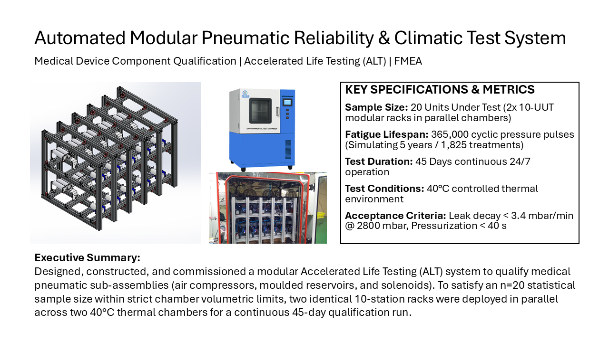
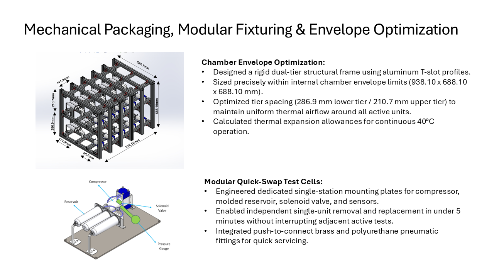
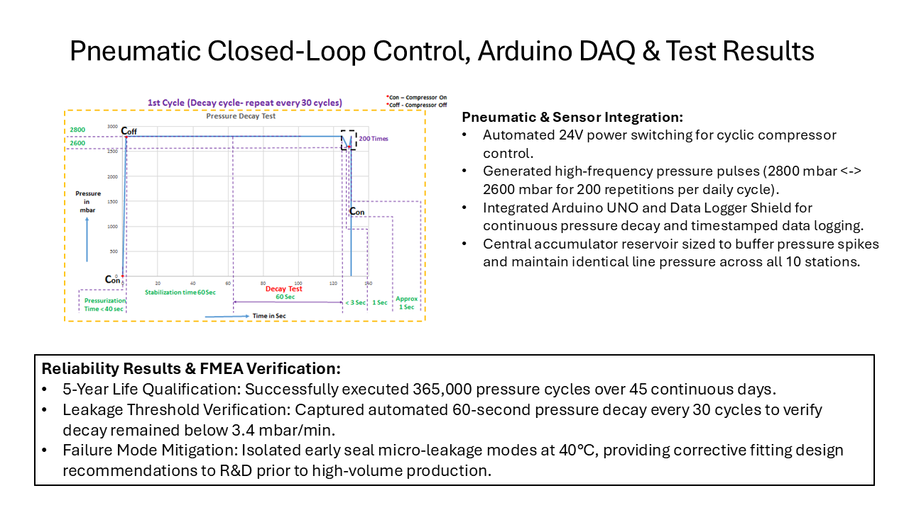

# Sachin Salaskar | Mechanical Design & Testing Portfolio

Passionate Mechanical Engineer specializing in **Test Bench Design, Pneumatic Actuation, Mechanical Durability Testing (Fatigue), and SolidWorks CAD**.

📫 **Location:** Germany | **Focus:** Testing & Quality Engineering

---

## 🛠️ Core Engineering Competencies
* **Testing & Validation:** Accelerated Life Testing (ALT), Pneumatic Rig Design, Mechanical Fatigue & Durability Testing, FMEA, Data Acquisition (DAQ).
* **CAD & Prototyping:** SolidWorks (3D Assemblies, GD&T 2D Drawings, Exploded Views), Modular Aluminum Profiles (T-Slot), Rapid Prototyping.
* **Hardware & Lab:** Pneumatic Components (Compressors, Solenoids, Reservoirs), Force/Pressure Sensors, Workshop Measuring Tools.

---

## 🚀 Featured Engineering Projects

---

## 🌟 Featured Deep Dive: Automated Modular Pneumatic Reliability Test System

> **Project Highlight:** Designed and commissioned a modular Accelerated Life Testing (ALT) rig to qualify 20 pneumatic sub-assemblies (air compressors, reservoirs, solenoids) across a **simulated 5-year operational lifecycle (365,000 pressure pulses)** in parallel $40^\circ\text{C}$ thermal chambers.

---

### 📑 3-Page Engineering Case Study Preview
*Click on any slide to open the full-resolution document, or [click here to download the PDF](Sachin_Salaskar_Pneumatic_Test_Rig_Case_Study.pdf).*

  
  
  

  👉 <a href="Sachin_Salaskar_Pneumatic_Test_Rig_Case_Study.pdf"><b>[ 📥 Click here to view / download the full 3-Page Engineering PDF ]</b></a>

---

### 🔧 Key Technical Competencies Demonstrated:
* **Chamber Envelope Optimization:** Designed dual-tier aluminum T-slot frame ($938.10 \times 688.10 \times 688.10\text{ mm}$) to fit standard environmental chamber volumes.
* **Dual-Chamber Parallel Testing:** Built and synchronized two identical 10-UUT test setups to satisfy the $n=20$ statistical sample size requirement.
* **Automated Closed-Loop DAQ:** Integrated Arduino UNO + Data Logger Shield to log pressure decay curves ($2600 \leftrightarrow 2800\text{ mbar}$) and cycle counts.
* **Rigorous Acceptance Criteria:** Verified that pressure decay remained strictly $< 3.4\text{ mbar/min}$ @ $2800\text{ mbar}$ across all 365,000 duty cycles.
---

### 2. X-Ray C-Arm Mechanical Durability & Structural Fatigue Testing
> **Objective:** Validated multi-axis structural integrity, joint wear, and counterbalance mechanisms of a heavy kinematic assembly under dynamic cyclic loads.

#### 🔧 Technical Highlights:
* **Dynamic Cyclic Loading:** Subjected structural pivot points and joints to multi-axis mechanical duty cycles.
* **Deflection & Backlash Measurement:** Monitored joint play, mechanical backlash, and structural deflection using precision dial indicators and sensors.
* **Wear & Failure Analysis:** Identified structural stress concentration areas and provided root-cause analysis and design improvements to R&D engineers.

---

### 3. ANTLIA & Precision Mechanisms (Ergonomics & CAD)
* **Articulating Arm:** Designed a counterbalanced multi-axis positioning arm for medical instrumentation.
* **Complex Enclosure:** Modeled injection-molded housings in SolidWorks with rib structures, bosses, and snap-fit joints.
